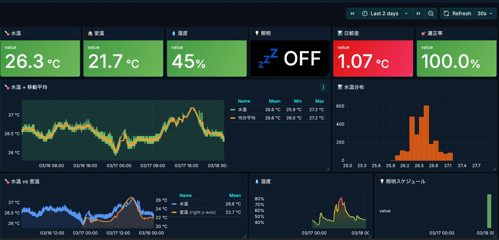
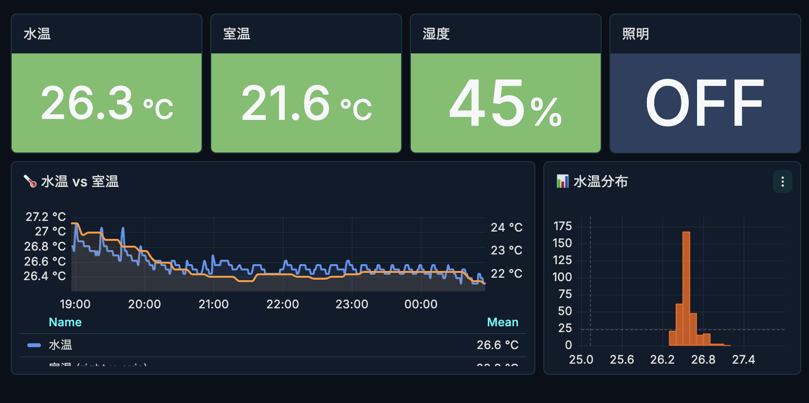

# AquaPulse 🌊

**淡水アクアリウムの環境データ収集・可視化・因果推論基盤**

[English version](README.md)

## What's this?

**ゴール**: 魚が長生きし、水草が元気に育つ環境を維持すること。勘ではなくデータで。

環境データ（水温、室温、湿度、照明）を収集し、因果推論で「何が水質に影響するか」「いつ介入すべきか」を明らかにする。

**リスク管理**（ボラティリティ最小化） / **コスト最適化**（作業工数削減） / **SLA 向上**（異常検知・即時対応）

### ダッシュボード

| PC版（詳細分析） | 7インチディスプレイ（一目で確認） |
|:----------------:|:---------------------------------:|
|  |  |

## Current Status

| 機能 | 状態 | 備考 |
|------|------|------|
| センサーデータ収集 | ✅ 稼働中 | 水温、室温、湿度、照明ON/OFF |
| TimescaleDB 蓄積 | ✅ 稼働中 | 1ヶ月以上のデータ蓄積 |
| Grafana 可視化 | ✅ 稼働中 | PC + タッチディスプレイ（キオスク） |
| イベント記録 | ⚠️ 暫定運用 | Grafana Annotation で記録中 |
| 因果推論モデル | 🔜 未着手 | データ蓄積後に着手予定 |

---

| Phase | 内容 | 状態 |
|-------|------|------|
| **1** | センサーデータの収集・可視化 | ✅ 完了 |
| **2** | 介入イベント（餌やり、水換え等）の記録 | ⚠️ Grafana Annotation で暫定対応中 |
| **3** | 因果推論モデルの構築（PC側で学習） | 未着手 |
| **4** | エッジ推論（ラズパイでリアルタイム予測） | 未着手 |

> **なぜ「生体の死」を KGI にしないか**: データが疎で交絡因子が多いため、直接的な最適化には不向き。代わりに「水温のボラティリティ」「水換えインターバル」「異常滞在時間」といったプロキシ KGI を採用 → [詳細](docs/design/metrics.md)

---

## 🏗 アーキテクチャ

```
┌─────────────┐     ┌─────────────┐     ┌─────────────┐
│   Sensors   │────▶│ TimescaleDB │────▶│   Grafana   │
│ (Tapo/GPIO) │     │   (Raw)     │     │  (Display)  │
└─────────────┘     └──────┬──────┘     └─────────────┘
                           │
                    ┌──────▼──────┐
                    │  Features   │  ← Continuous Aggregates
                    │ (1min/5min) │
                    └──────┬──────┘
                           │
              ┌────────────▼────────────┐
              │    ML Training (PC)     │
              │  - Point-in-Time JOIN   │
              │  - Causal Inference     │
              └────────────┬────────────┘
                           │
                    ┌──────▼──────┐
                    │ Edge Infer  │  ← Future
                    │ (Raspberry) │
                    └─────────────┘
```

**設計原則**:
- **収集は非同期・不規則（Raw）** → センサーごとの制約に合わせた独立した間隔
- **特徴量生成は TimescaleDB に任せる** → Continuous Aggregates, gapfill
- **学習は PC、推論はエッジ** → 計算資源の適切な分離
- **Point-in-Time Correctness** → 未来情報のリーク防止

> 詳細: [docs/design/architecture.md](docs/design/architecture.md)

---

## 🛠 技術スタック

| 項目 | 技術 |
|------|------|
| Device | Raspberry Pi 5 (8GB) + NVMe SSD |
| Display | Pi Touch Display 1 (800x480) |
| OS | Raspberry Pi OS Lite (Bookworm, 64-bit) |
| Language | Python 3.11+ |
| Database | TimescaleDB (PostgreSQL) |
| Visualization | Grafana (キオスクモード: cage + Chromium) |
| Infrastructure | Docker / Docker Compose |

---

## 📊 データソース

### センサー（ポーリング状態）

| センサー | 状態 | ソース | 間隔 |
|----------|------|--------|------|
| DS18B20 水温 | ✅ | `gpio_temp` | 60秒 |
| Tapo T310 温湿度 | ✅ | `tapo_sensors` | 300秒 |
| Tapo P300 照明状態 | ✅ | `tapo_lighting` | 300秒 |
| TDS センサー | ⚠️ 瓶測定 | `gpio_tds` | 手動 |
| pH センサー | 🔜 | - | - |

### イベント（将来実装）

| イベント | 記録方法 |
|----------|----------|
| 餌やり | スマホから記録 |
| 水換え | スマホから記録 |
| 生体追加/死亡 | スマホから記録 |

---

## 📂 ディレクトリ構成

```
aquapulse/
├── collector/       # センサーデータ収集モジュール
├── db/              # データベース初期化・マイグレーション
├── grafana/         # Grafana 設定
├── kiosk/           # キオスクモード設定スクリプト
└── docs/
    ├── display/     # ディスプレイ・キオスク設定
    ├── hardware/    # 配線・センサー
    ├── operations/  # 運用ログ
    └── design/      # 設計・アーキテクチャ
```

---

## 💻 クイックスタート

```bash
# Docker Compose で起動
cd /projects/aquapulse
docker compose up -d

# キオスクモードを有効化（ディスプレイ表示）
sudo systemctl enable grafana-kiosk
sudo systemctl start grafana-kiosk
```

---

## 📖 ドキュメント

| ドキュメント | 内容 |
|--------------|------|
| [アーキテクチャ設計](docs/design/architecture.md) | ML・因果推論のためのデータ基盤設計 |
| [評価指標設計](docs/design/metrics.md) | KGI/KPI・プロキシ指標の考え方 |
| [Grafana キオスク](docs/display/grafana-kiosk.md) | ディスプレイ表示の設定・運用 |
| [配線記録](docs/hardware/wiring/) | ピン配置・センサー接続 |
| [作業ログ](docs/operations/daily-log.md) | 日次の作業記録 |

---

## 📝 License

MIT
