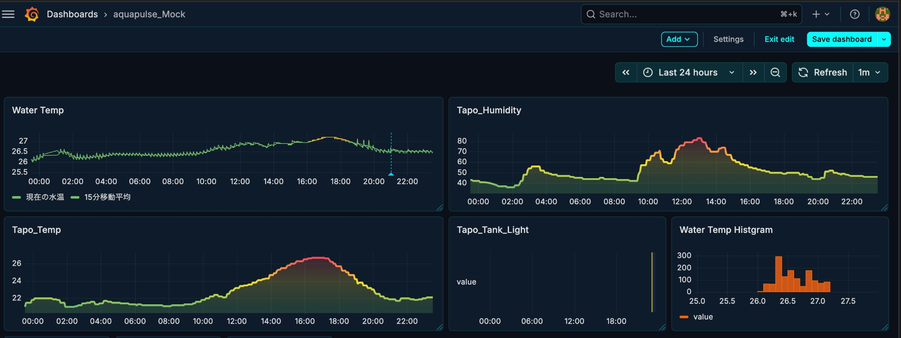

# AquaPulse 🌊

**Freshwater Aquarium IoT: Data Collection, Visualization & Causal Inference**

[日本語版はこちら](README.ja.md)

## What's this?

**Goal**: Keep fish healthy and plants thriving by maintaining optimal water conditions — using data, not guesswork.

Collecting environmental data (water temp, room temp, humidity, lighting) and applying causal inference to understand what actually affects water quality and when to intervene.



## Current Status

| Feature | Status | Notes |
|---------|--------|-------|
| Sensor Data Collection | ✅ Running | Water temp, room temp, humidity, lighting ON/OFF |
| TimescaleDB Storage | ✅ Running | 1+ month of accumulated data |
| Grafana Dashboard | ✅ Running | PC + Touch Display (kiosk mode) |
| Event Logging | ⚠️ Interim | Using Grafana Annotations |
| Causal Inference Model | 🔜 Planned | After sufficient data accumulation |

---

## Roadmap

| Phase | Description | Status |
|-------|-------------|--------|
| **1** | Sensor data collection & visualization | ✅ Done |
| **2** | Intervention events (feeding, water changes, etc.) | ⚠️ Interim solution |
| **3** | Causal inference model (training on PC) | Not started |
| **4** | Edge inference (real-time prediction on Raspberry Pi) | Not started |

> **Why not use "fish death" as KGI?** Data is sparse and confounding factors are numerous. Instead, we use proxy KGIs: water temperature volatility, water change intervals, time in abnormal state. → [Details](docs/design/metrics.md)

---

## Architecture

```
┌─────────────┐     ┌─────────────┐     ┌─────────────┐
│   Sensors   │────▶│ TimescaleDB │────▶│   Grafana   │
│ (Tapo/GPIO) │     │   (Raw)     │     │  (Display)  │
└─────────────┘     └──────┬──────┘     └─────────────┘
                           │
                    ┌──────▼──────┐
                    │  Features   │  ← Continuous Aggregates
                    │ (1min/5min) │
                    └──────┬──────┘
                           │
              ┌────────────▼────────────┐
              │    ML Training (PC)     │
              │  - Point-in-Time JOIN   │
              │  - Causal Inference     │
              └────────────┬────────────┘
                           │
                    ┌──────▼──────┐
                    │ Edge Infer  │  ← Future
                    │ (Raspberry) │
                    └─────────────┘
```

**Design Principles**:
- **Async collection (Raw)** → Independent intervals per sensor constraints
- **Feature generation in TimescaleDB** → Continuous Aggregates, gapfill
- **Train on PC, infer on edge** → Proper separation of compute resources
- **Point-in-Time Correctness** → Prevent future data leakage

> Details: [docs/design/architecture.md](docs/design/architecture.md)

---

## Tech Stack

| Component | Technology |
|-----------|------------|
| Device | Raspberry Pi 5 (8GB) + NVMe SSD |
| Display | Pi Touch Display 1 (800x480) |
| OS | Raspberry Pi OS Lite (Bookworm, 64-bit) |
| Language | Python 3.11+ |
| Database | TimescaleDB (PostgreSQL) |
| Visualization | Grafana (kiosk mode: cage + Chromium) |
| Infrastructure | Docker / Docker Compose |

---

## Data Sources

### Sensors (Polling)

| Sensor | Status | Source | Interval |
|--------|--------|--------|----------|
| DS18B20 Water Temp | ✅ | `gpio_temp` | 60s |
| Tapo T310 Temp/Humidity | ✅ | `tapo_sensors` | 300s |
| Tapo P300 Lighting State | ✅ | `tapo_lighting` | 300s |
| TDS Sensor | ⚠️ Manual | `gpio_tds` | On-demand |
| pH Sensor | 🔜 | - | - |

### Events (Planned)

| Event | Recording Method |
|-------|------------------|
| Feeding | Mobile app |
| Water Change | Mobile app |
| Livestock Add/Death | Mobile app |

---

## Directory Structure

```
aquapulse/
├── collector/       # Sensor data collection module
├── db/              # Database init & migrations
├── grafana/         # Grafana configuration
├── kiosk/           # Kiosk mode scripts
└── docs/
    ├── display/     # Display & kiosk setup
    ├── hardware/    # Wiring & sensors
    ├── operations/  # Operation logs
    └── design/      # Architecture & design
```

---

## Quick Start

```bash
# Start with Docker Compose
cd /projects/aquapulse
docker compose up -d

# Enable kiosk mode (display)
sudo systemctl enable grafana-kiosk
sudo systemctl start grafana-kiosk
```

---

## Documentation

| Document | Description |
|----------|-------------|
| [Architecture](docs/design/architecture.md) | ML & causal inference data platform design |
| [Metrics Design](docs/design/metrics.md) | KGI/KPI & proxy metrics approach |
| [Grafana Kiosk](docs/display/grafana-kiosk.md) | Display setup & operation |
| [Wiring](docs/hardware/wiring/) | Pin layout & sensor connections |
| [Daily Log](docs/operations/daily-log.md) | Work logs (Japanese) |

---

## License

MIT
